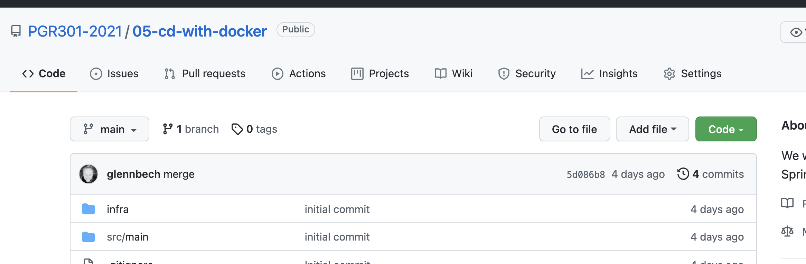

#CD med GitHub Actions, AWS Apprunner og Docker.

I denne oppgaven skal vi 

* Lag en ny Spring Boot applikasjon 
* Bygge et Docker image for Spring applikasjonen
* Publisere docker image til ECR, AWS sitt Container registry som fyller samme funksjon som DockerHub. 
* Igjen se på AWS Apprunner, men denne gangen lage en applikasjon basert på et Container image i ECR istedet for et GitHub Repo
* Se at applikasjonen blir deployet av Apprunner når vi pusher ny versjon av Image til ECR

## Lag et repo og et Spring Boot "hello verden" prosjekt

Bruk Spring Initializer (https://start.spring.io/)  til å lage et nytt Spring Boot prosjekt, evt ta inspirasjon i dette repoet.
Prosjektet skal ha en fungerende Dockerfile som lager container image av java-applikasjonen

## Få API nøkler til AWS

Instruksjoner om hvordan du får AWS Access Key ID & Secret Key gis i klasserommet.

## Gi  GitHub Actions tilgang til nøkler

Velg "settings" for ditt repository



Fra venstremenyen velg "secrets

"

Velg "New Repository secret" og lag følgende hemmeligheter

* AWS_ACCESS_KEY_ID=The = ```Access Key ID``` 
* AWS_SECRET_ACCESS_KEY = ```Secret Access Key```

Fra vår GitHub action "workflow" dokument kan vi referere til disse hemmeligehtene på
følgende syntaks

```yaml
${{ secrets.AWS_ACCESS_KEY_ID }}
```

## Kort om AWS ECR 

ECR (Elastic Container Registry) fyller samme funksjon som Docker Hub, og gir både private og offentlig lagring ac Container 
images. 

## Lag en GitHub Actions arbeidsflyt for å bygge & deploye container image til ECR 

```yaml
# This workflow uses actions that are not certified by GitHub.
# They are provided by a third-party and are governed by
# separate terms of service, privacy policy, and support
# documentation.

name: Publish Docker image

on:
  release:
    types: [published]

jobs:
  push_to_registry:
    name: Push Docker image to Docker Hub
    runs-on: ubuntu-latest
    steps:
      - name: Check out the repo
        uses: actions/checkout@v2
    
      - name: Build and push Docker image
        run: |
          aws ecr-public get-login-password --region us-east-1 | docker login --username AWS --password-stdin public.ecr.aws
          docker build .
          aws ecr-public create-repository  --repository-name ecr-tutorial --catalog-data file://repositorycatalogdata.json --region eu-north-1 

```


NB. Dere trenger ikke publisere til GitHub Packages!
Følg denne guiden <'https://docs.github.com/en/actions/publishing-packages/publishing-docker-images'>

I denne oppgaven skal vi sørge for at

* Arbeidsflyten skal bare bygge Docker container image på hver push
* Ved push til master skal også applikasjonen deployes til AWS Apprunner


# Lek med Feature toggles 
