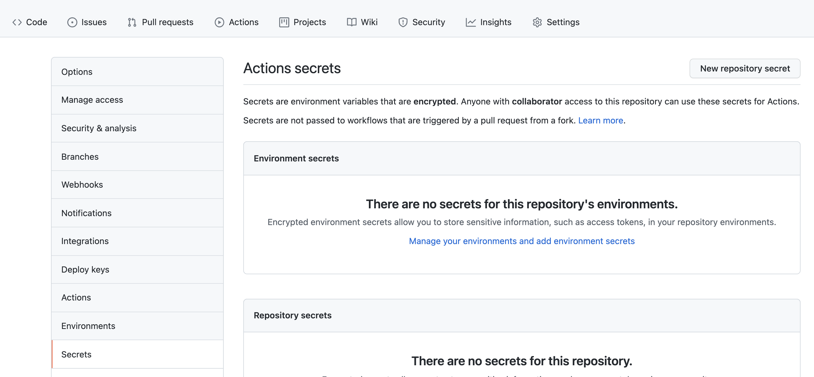
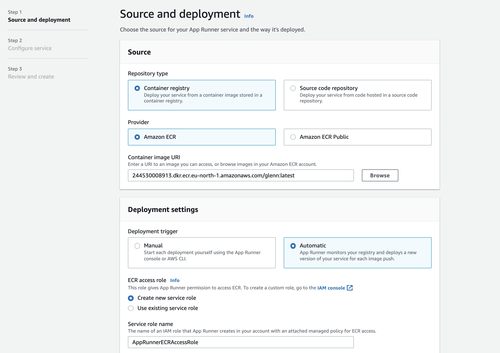

# Kontinuerlig deployment med GitHub Actions, AWS Apprunner og Docker.

I denne oppgaven skal vi 

* Lag en ny Spring Boot applikasjon 
* Bygge et Docker image fra Spring applikasjonen
* Publisere docker image til ECR, AWS sitt Container registry som fyller samme funksjon som DockerHub fra forrige øving 
* Igjen se på AWS Apprunner, men denne gangen lage en applikasjon basert på et Container image i ECR istedet for et GitHub Repo
* Se at applikasjonen blir deployet av Apprunner når vi pusher ny versjon av Image til ECR
* Bli bedre kjent med Cloud9

## Logg på Cloud9 miljøet ditt

Du må dekryptere passordet til din *IAM bruker*. 

Windowsbrukere:

* Bruk https://base64.guru/converter/decode/file - lim inn det krypterte passordet, og last ned filen _application.bin_
* Kjør

```
gpg --decrypt application.bin
```

Osx

* Osx brukere kan gjøre base64 dekoding og fra kommandolinje. 

```
  echo -n `base64 <enkodet kryptert passord>` | base64 --decode > encrypted_password.bin
  gpg --decrypt encrypted_password.bin
```

(Windows fremgangsmåten fungerer også!)

Du vil nå se passordet, for eksempel "9s1Lsd0#". Passordet skal være 8 tegn langt. Ignorer eventuelt % tegn på slutten av linja (som ser ut å komme base på OSX)
Når du har passordet, går du til Cloud9 url for din bruker.

I denne øvingen trenger vi også IAM aksessnøkler for din bruker. Disse har to attributter

* ```Acess Key ID``` - en identifikator for en nøkkel. Denne finner du i klartekst i påloggingsinfo
* ```Secret Access Key``` - En hemmelighet som ikke må deles. 

* Du må dekryptere denne på samme måte som AWS Passord. Noter Access Key ID og dekryptert Secret Access Key til senere.

### Sjekk ut cloud9 miljøet ditt

Logg på Cloud 9 med en URL som typisk ser slik ut (URL er gitt i klasserommet)
<https://eu-north-1.console.aws.amazon.com/cloud9/ide/738cc6fddc7949bb90f6bb715e8c9441>

Brukernavn er student-navnet ditt feks geto002, passordet er dekryptert IAM passord.

Hvis du velger "AWS" ikonet på venstremenyen vil du se "AWS Explorer" velger du ECR vil du finne et ECR Repo med ditt brukernavn,
men ingen container images. (No tags found)


## Lag et repo og et Spring Boot "hello verden" prosjekt

På egen PC...

Bruk Spring Initializer (https://start.spring.io/)  til å lage et nytt Spring Boot prosjekt, evt ta inspirasjon i dette repoet, 
eller bruk noe dere har fra før. 

Verifiser at spring applikasjonen kjører

```shell
mvn spring-boot:run
```

## Dockerize it!

Lag en Dockerfile, her er et eksempel. Ta en kikke på https://github.com/PGR301-2021/04-cd-part-2 hvis du ikke husker helt 
hvor denne skal osv. 

```
FROM maven:3.6-jdk-11 as builder
WORKDIR /app
COPY pom.xml .
COPY src ./src
RUN mvn package

FROM adoptopenjdk/openjdk11:alpine-slim
COPY --from=builder /app/target/*.jar /app/application.jar
ENTRYPOINT ["java","-jar","/app/application.jar"]
```

Du trenger ikke Docker på egen maskin. Bare sørg for at Spring Boot applikasjonen starter og lytter på localhost:8080 når du kjører
Push applikasjonen og repoet til GitHub brukeren din.

## Lag og last opp Container Image til Amazon ECR fra Cloud9

* Start Cloud9 miljøet ditt 
* Åpne en Terminal 
* Lag en klone av GitHub repeo du lagde på egen maskin i Cloud9 med ```git clone ...``` (du må bruke https URL).   

I forrige øving lagde vi Docker images og lastet de opp til Docker Hub. Nå skal vi gjøre det samme, men laste opp Container image til 
AWS ECR slik at vi kan bruke AWS Apprunner til å kjøre en container. 

I en Cloud9 terminal, autentiser du Docker mot ECR. bygger et container image, lager en tag "latest" og pusher denne til 
Amazon ECR med navnet ```244530008913.dkr.ecr.eu-west-1.amazonaws.com/glenn:latest```- Obs. Legg merke til at vi bygget et container image
med navn "hello" lokalt. Men at vi bygger navn når vi tagger og pusher til ECR.

(her må du bytte ut "glenn" med eget brukernavn)
```shell
 aws ecr get-login-password --region eu-west-1 | docker login --username AWS --password-stdin 244530008913.dkr.ecr.eu-west-1.amazonaws.com
 docker build . -t hello
 docker tag hello:latest 244530008913.dkr.ecr.eu-west-1.amazonaws.com/glenn:latest
 docker push 244530008913.dkr.ecr.eu-west-1.amazonaws.com/glenn:latest
```
Du skal nå kunne se en "latest" tag under ditt ECR reposiotry i Cloud9 explorer 


Legg merke til at vi nå ikke trengte verken siste versjon av Java eller Maven for å få kompilert Spring Boot applikasjonen vår!!
Det løses ved at vi lager en egen container med Docker for å kompilere og bygge JAR filen, så kopieres JAR filen over i en annen
"runtime" container. 

Docker FTW :)

Sjekk også gjerne ut ECR i AWS Console ved å velge "Go to your Dashboard" fra Cloud9 


Velg tjenesten ECR


# AWS Apprunner med container  & Deployment med GitHub Actions 

Vi skal nå kjøre vår container i AWS Apprunner, men vi skal la GitHub Actions deploye container images for oss hver gang kildekoden 
på GitHub endrer seg. 

## Gi GitHub Actions tilgang til nøkler

Velg "settings" for ditt repository. Fra venstremenyen velg "secrets



Velg "New Repository secret" og lag følgende hemmeligheter

* AWS_ACCESS_KEY_ID=The = ```Access Key ID``` 
* AWS_SECRET_ACCESS_KEY = ```Secret Access Key```

Fra vår GitHub action "workflow" dokument kan vi referere til disse hemmeligehtene på  følgende syntaks

```yaml
${{ secrets.AWS_ACCESS_KEY_ID }}
```

## Lag en GitHub Actions arbeidsflyt for å bygge & deploye container image til ECR 

lag følgende fil under katalogen ```.github/workflows/``` i ditt repository. NB. Her må du erstatte "glenn" 
med ditt eget brukernavn

```yaml
name: Publish Docker image

on:
  # Trigger the workflow on push or pull request,
  # but only for the main branch
  push:
    branches:
      - main
  pull_request:
    branches:
      - main
jobs:
  push_to_registry:
    name: Push Docker image to Docker Hub
    runs-on: ubuntu-latest
    steps:
      - name: Check out the repo
        uses: actions/checkout@v2

      - name: Build and push Docker image
        env:
          AWS_ACCESS_KEY_ID: ${{ secrets.AWS_ACCESS_KEY_ID }}
          AWS_SECRET_ACCESS_KEY: ${{ secrets.AWS_SECRET_ACCESS_KEY }}
        run: |
          aws ecr get-login-password --region eu-west-1 | docker login --username AWS --password-stdin 244530008913.dkr.ecr.eu-west-1.amazonaws.com
          docker build . -t hello
          docker tag hello:latest 244530008913.dkr.ecr.eu-west-1.amazonaws.com/glenn:latest
          docker push 244530008913.dkr.ecr.eu-west-1.amazonaws.com/glenn:latest
```

## Konfigurer AWS Apprunner

Nå skal vi konfigurere AWS Apprunner igjen, men bruke "ECR" som kilde og ikke "Source code repository som sist"



* Velg "Amazon ECR" som "Repository type"
* Image name er for eksempel ```244530008913.dkr.ecr.eu-west-1.amazonaws.com/glenn:latest```
* Velg "automatic deployments"
* Velg Use existing service role.

På de to påfølgende sidene kan dere akseptere default.

* Velg create Service

Verifiser at du kan endre koden, pushe og få ny versjon av applikasjonen i AWS Apprunner! 


